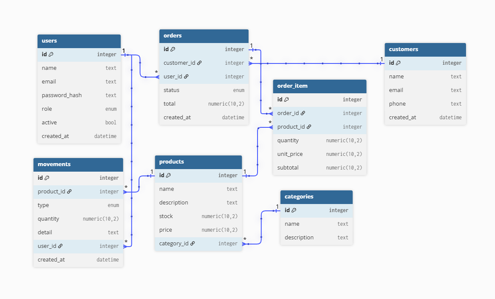

# Business API

## Descripción

API REST para la gestión de productos, categorías, clientes, usuarios, pedidos y movimientos de stock de una empresa.
El proyecto fue desarrollado utilizando Python, FastAPI, PostgreSQL, SQLAlchemy, Alembic y Docker, incorporando autenticación mediante JWT, control de acceso por roles, validación de datos y gestión de migraciones con Alembic.
La aplicación está containerizada con Docker y utiliza Docker Compose para coordinar la API y la base de datos PostgreSQL.

---
## Tecnologías

* Python 3.14
* FastAPI
* PostgreSQL 18
* SQLAlchemy
* Pydantic
* JWT
* pwdlib
* Alembic
* Docker
* Git / Github

---
## Características

* Autenticación de usuario mediante JWT.
* Control de acceso basado en roles (ADMIN y EMPLOYEE).
* Gestió de usuario.
* Gestió de categorías.
* Gestió de productos.
* Gestió de clientes.
* Gestió de pedidos.
* Gestió de movimientos de stock.
* Control de stock y cantidades mediante restricciones de base de datos.
* Registro de movimientos de entrada y salida de stock.
* Gestión transaccional de pedidos y actualización de stock.
* Validación de datos mediante Pydantic.
* Persistencia mediante SQLAlchemy y PostgreSQL.
* Migraciones de base de datos mediante Alembic.
* Configuración mediante variables de entorno.
* Ejecución mediante Docker y Docker Compose.

---
## Arquitectura del proyecto

```text
Business API/
│
├── alembic/
│   ├── versions/
│   │   └── 9aaf1a8fba0d_initial.py
│   ├── env.py
│   ├── script.py.mako
│   └── README
│
├── app/
│   ├── core/
│   │   ├── config.py
│   │   ├── logger.py
│   │   └── security.py
│   │
│   ├── database/
│   │   ├── base.py
│   │   └── connection.py
│   │
│   ├── models/
│   │   ├── __ init __.py
│   │   ├── categories.py
│   │   ├── customers.py
│   │   ├── movements.py
│   │   ├── order_items.py
│   │   ├── orders.py
│   │   ├── products.py
│   │   └── users.py
│   │
│   ├── routers/
│   │   ├── categories.py
│   │   ├── customers.py
│   │   ├── login.py
│   │   ├── movements.py
│   │   ├── orders.py
│   │   ├── products.py
│   │   └── users.py
│   │
│   ├── schemas/
│   │   ├── categories.py
│   │   ├── customers.py
│   │   ├── login.py
│   │   ├── movements.py
│   │   ├── order_items.py
│   │   ├── orders.py
│   │   ├── products.py
│   │   └── users.py
│   │
│   ├── services/
│   │   ├── categories.py
│   │   ├── customers.py
│   │   ├── login.py
│   │   ├── movements.py
│   │   ├── orders.py
│   │   ├── products.py
│   │   └── users.py
│   │
│   ├── dependencies.py
│   └── main.py
│
├── docs/
│   └── image/
│       └── entity_relationship.png
│
├── .dockerignore
├── .env.example
├── .gitignore
├── alembic.ini
├── docker-compose.yml
├── Dockerfile
├── README.md
└── requirements.txt
```

### Descripción de las principales capas

* app/core/: Configuración general, seguridad, autenticación y logging de la aplicación.
* app/database/: Configuración de SQLAlchemy, conexión con PostgreSQL y definición de la base declarativa.
* app/models/: Modelos ORM que representan las entidades y tablas de la base de datos.
* app/schemas/: Esquemas Pydantic utilizados para validar los datos de entrada y salida de la API.
* app/routers/: Definición de los Endpoints y rutas HTTP.
* app/services/: Lógica de negocio de cada módulo.
* app/dependencies.py: dependencias reutilizables de FastAPI, como la obtención de la sesión de base de datos y el usuario autenticado.
* app/main.py: Punto de entrada de la aplicación FastAPI.
* alembic/: Sistema de migraciones de la base de datos.
* Dockerfile: Instrucciones para construir la imagen de la API.
* docker-compose.yml: Configuración de los servicios de la aplicación y PostgreSQL.
* .env.example: Plantilla de las variables de entorno necesarias para ejecutar el proyecto.
* requirements.txt: Dependencias de Python del proyecto.

---
## Base de datos

La aplicación utiliza PostgreSQL 18 como sistema gestor de base de datos y SQLAlchemy como ORM.
La estructura de la base de datos se encuentra representada mediante modelos SQLAlchemy dentro de app/models/.

### Diagrama entidad-relación

El siguiente diagrama representa las principales entidades de la aplicación y las relaciones existentes entre ellas.



### Restricciones de integridad

La base de datos utiliza restricciones para mantener la consistencia de los datos. Entre ellas:

* Los nombre de categorías, productos y correos electrónicos de usuarios y clientes son únicos.
* El precio y el stock de los productos no pueden ser negativos.
* La cantidad de un movimiento debe ser mayor que cero.
* El total de un pedido no puede ser negatvo.
* Las relaciones entre entidades utilizan claves foráneas.
* Los roles, estados de pedidos y tipos de movimiento utilizan tipos Enum de PostgreSQL.

### Migraciones con Alembic

La estructura de la base de datos se gestiona mediante Alembic, permitiendo versionar y aplicar cambios de esquema de forma controlada.

Las migraciones se encuentran en: alembic/versions/

Para generar una nueva migración a partir de cambios realizados en los modelos: docker compose exec api alembic revision --autogenerate -m "descripción del cambio"
Las migraciones generadas deben revisarse antes de aplicarlas.

Para aplicar las migraciones pendientes: docker compose exec api alembic upgrade head

Para consultar la migración actualmente aplicada: docker compose exec api alembic current

La tabla alembic_version permite a Alembic identificar qué revisión se encuentra aplicada actualmente en la base de datos.

---
## Configuración

La aplicación utiliza variables de entorno para configurar la conexión con la base de datos, la autenticación mediante JWT y los parámetros de PostgreSQL.

Antes de ejecutar la aplicación, es necesario crear un archivo .env en la raíz del proyecto a partir del archivo .env.example.

El archivo .env contiene información sensible, por lo que se encuentra incluido en .gitignore y no se almacena en el repositorio.

### Variables de entorno

- DATABASE_URL: URL de conexión con la base de datos PostgreSQL.
- SECRET_KEY: Clave secreta utilizada para firmar los tokens JWT.
- ALGORITHM: Algoritmo utilizado para la autenticación JWT.
- ACCESS_TOKEN_EXPIRE_MINUTES: Tiempo de expiración de los tokens, expresado en minutos.
- POSTGRES_USER: Usuario de PostgreSQL.
- POSTGRES_PASSWORD: Contraseña de PostgreSQL.
- POSTGRES_DB: Nombre de la base de datos.

El repositorio incluye .env.example como plantilla con las variables necesarias, sin exponer credenciales ni información sensible.

---
## Docker

La aplicación esta containerizada mediante Docker y utiliza Docker Compose para ejecutar y coordinar los servicios de la API y la base de datos PostgreSQL.

El archivo docker-compose.yml define dos servicios:
- api: ejecuta la aplicacion FastAPI
- db: ejecuta PostgreSQL 18.

La base de datos utiliza un volumen de Docker para conservar la información aunque el contenedor sea detenido o recreado.

### Ejecución

Para construir la imagen de la API y levantar todos los servicios:
__docker compose up --build -d__

Una vez iniciados los contenedores, la API queda disponible en:
http://localhost:8000

La documentación interactiva de FastAPI puede consultarse en:
http://localhost:8000/docs

### Comandos principales

Detener los servicios:
__docker compose stop__

Volver a iniciar los servicios detenidos:
__docker compose start__

Detener y eliminar los contenedores:
__docker compose down__

Reconstruir la imagen de la API y volver a levantar los servicios:
__docker compose up --build -d__

Para consultar el estado de los contenedores:
__docker compose ps__
__docker compose ps -a__

Los datos de PostgreSQL se almacenan en un volumen de Docker, por lo que docker compose down no elimina los datos de la base de datos. Para eliminar también el volumen y sus datos se debe utilizar:
__docker compose down -v__

---
## Documentación de la API

La API cuenta con documentación interactiva generada automaticamente por FastAPI.
Una vez iniciada la aplicación, se puede acceder a las siguientes interfaces:

### Swagger UI

Permite visualizar los endpoints disponibles, consultar sus parámetros y probar las solicitudes directamente desde el navegador.

http://localhost:8000/docs

### ReDoc

Proporciona una vista alternativa de la documentación de la API, organizada a partir del esquema OpenAPI generado por FastAPI.

http://localhost:8000/redoc

La documentación se actualiza automáticamente a partir de las rutas, schemas y modelos definidos en la aplicación.

---
## Endpoints principales

La API se encuentra organizada en diferentes recursos, cada uno encargado de una parte específica de la gestión de la aplicación.

### Usuarios

| Método | Endpoint | Descripción | Autenticación | Rol requerido |
|---|---|---|---|---|
| POST | /user/employee | Crear usuario con rol empleado | No | -- |
| POST | /user/admin | Crear usuario(solo para admin) | Sí | ADMIN |
| GET | /user/me | Consultar información sobre el usuario actual | Sí | -- |
| GET | /user/ | Consultar información sobre todos los usuarios | Sí | ADMIN |
| PUT | /user/ | Modificar información del usuario actual | Sí | -- |
| DELETE | /user/me | Eliminar usuario actual | Sí | -- |
| DELETE | /user/admin | Eliminar usuario | Sí | ADMIN |

### Login

| Método | Endpoint | Descripción | Autenticación | Rol requerido |
|---|---|---|---|---|
| POST | /login/ | Iniciar sesion | No | -- |

### Categorías

| Método | Endpoint | Descripción | Autenticación | Rol requerido |
|---|---|---|---|---|
| POST | /category/ | Crear categoría | Sí | ADMIN |
| GET | /category/{category_id} | Consultar categoría | No | -- |
| GET | /category/ | Consultar todas las categorías | No | -- |
| PUT | /category/ | Modificar categoría | Sí | ADMIN |
| DELETE | /category/ | Eliminar categoría | Sí | ADMIN |

### Productos

| Método | Endpoint | Descripción | Autenticación | Rol requerido |
|---|---|---|---|---|
| POST | /product/ | Crear producto | Sí | ADMIN |
| GET | /product/{product_id} | Consultar información del producto | Sí | -- |
| GET | /product/ | Consultar información de todos los productos | Sí | -- |
| PUT | /product/ | Modificar producto | Sí | ADMIN |
| DELETE | /product/ | Eliminar producto | Sí | ADMIN |

### Movimientos

| Método | Endpoint | Descripción | Autenticación | Rol requerido |
|---|---|---|---|---|
| POST | /movement/ | Crear movimiento | Sí | ADMIN |
| GET | /movement/{movement_id} | Consultar información por id de movimiento | Sí | ADMIN |
| GET | /movement/user/{user_id} | Consultar información por id de usuario | Sí | ADMIN |
| GET | /movement/product/{product_id} | Consultar información por id de producto | Sí | ADMIN |
| GET | /movement/ | Consultar información de todos los movimientos | Sí | ADMIN |

### Clientes

| Método | Endpoint | Descripción | Autenticación | Rol requerido |
|---|---|---|---|---|
| POST | /customer/ | Crear cuenta de cliente | Sí | -- |
| GET | /customer/{customer_id} | Consultar información del cliente | Sí | -- |
| GET | /customer/ | Consultar información de todos los clientes | Sí | -- |
| PUT | /customer/ | Modificar información del cliente | Sí | -- |
| DELETE | /customer/ | Eliminar cliente | Sí | -- |

### Pedidos

| Método | Endpoint | Descripción | Autenticación | Rol requerido |
|---|---|---|---|---|
| POST | /order/ | Crear pedido | Sí | -- |
| GET | /order/ | Consultar información de los pedidos | Sí | -- |
| GET | /order/{order_id} | Consultar información del pedido | Sí | -- |
| PUT | /order/ | Modificar información del pedido | Sí | -- |

---
## Mejoras futuras

Algunas mejoras que se incorporaran en futuras versiones:

- Incorporar tests automatizados para los principales servicios y endpoints.
- Mejorar el manejo y registro de errores.
- Incorporar un sistema de logs más completo para monitoreo de la aplicación.
- Incorporar CI/CD para automatizar las pruebas y el despliegue de nuevas versiones.

---
## Autor

**Emiliano Nicolás Rivero**

Proyecto desarrollado para aplicar y profundizar conocimientos de desarrollo backend, utilizando Python, FastAPI, PostgreSQL, SQLAlchemy, Docker y Alembic.

[GitHub](https://github.com/nicolasrivero4)
